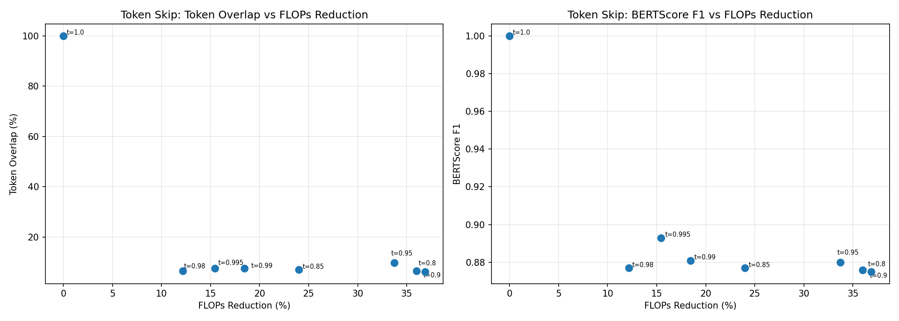
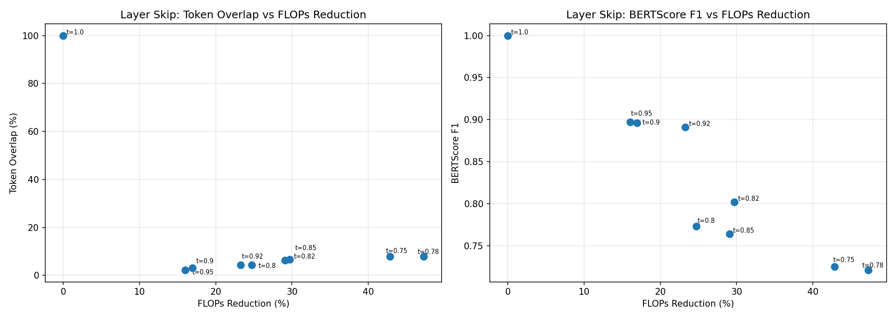

# Compute-Skipping Policies for Fast-dLLM v2

Two compute-skipping policies for Fast-dLLM v2 that reduce FLOPs during inference by skipping computations when hidden states converge.

**Token-level skipping** (across denoising steps): Compare the final hidden states of each token position across adjacent denoising steps using cosine similarity and make a decision to skip for the following step. If `cos_sim > threshold`, skip that token and reuse its last hidden state. The model only processes non-skipped tokens as queries with the full kv cache using the older entries for skipped tokens. Block KV cache is updated only for the non-skipped tokens. Full hidden states is reconstructed afterwards by inserting fresh outputs of non-skipped tokens into the last hidden states.

**Layer-level skipping** (within a denoising step): Compare input hidden states between adjacent layers within the same forward pass. If `cos_sim > threshold` (across all tokens), skip the layer and pass the input hidden states to the next layer.

To prevent infinite skipping when everything converges (all tokens skipped, or a layer is skipped), the stored hidden states are reset to `(None, None)` so the next iteration/layer is forced to execute a full pass.

Both policies are inactive during prefill to prevent empty cache entries. Token level skipping requires `use_block_cache=True` because it selects a subset of query tokens and requires the full kv cache for the skipped tokens, which needs a persistent block-level cache. Layer level skipping works with or without block cache.

In token level skipping to ensure the same number of tokens are chosen across samples in a batch, the number of skipped tokens is taken to be the minimum number of tokens across samples (m) that satisfy the condition. For samples with >m tokens satisfying the condition, m tokens with the highest cosine similarity are chosen. In layer level skipping, when we do batching we take the mean of the cosine similarity across batches for checking the condition.

## File Structure

```
patch_dllm/
  token_skip_policy.py             # TokenSkipPolicy class
  layer_skip_policy.py             # LayerSkipPolicy class
  monkey_patch_token_skip.py       # monkey patch for token skip
  monkey_patch_layer_skip.py       # monkey patch for layer skip
  utils.py                         # ComputeCounter, shared metrics (token overlap, BERTScore, seeding)
benchmark_skipping_policies.py     # accuracy vs FLOPs-reduction curves + plots
test_token_skip.py                 # token skip threshold sweep
test_layer_skip.py                 # layer skip threshold sweep
test_skip_output.py                # quick test to verify output with skipping policy
skipping_policies_results/         # generated plots and results JSON
```

## Usage

```python
from patch_dllm import TokenSkipPolicy, patch_token_skip, unpatch_token_skip
from patch_dllm import LayerSkipPolicy, patch_layer_skip, unpatch_layer_skip
from patch_dllm import ComputeCounter

# token skip (needs use_block_cache=True)
patch_token_skip(model)
counter = ComputeCounter()
ids = model.generate(input_ids, skip_policy=TokenSkipPolicy(threshold=0.99), compute_counter=counter, ...)
print(f"processed_tokens={counter.processed_tokens}")
unpatch_token_skip()

# layer skip (works with or without block cache)
patch_layer_skip(model)
counter = ComputeCounter()
ids = model.generate(input_ids, skip_policy=LayerSkipPolicy(threshold=0.95), compute_counter=counter, ...)
print(f"processed_tokens={counter.processed_tokens}")
unpatch_layer_skip()
```

## Metrics

**Token overlap** — positional exact match between baseline and skip-policy output tokens. Percentage of positions where the same token was generated.

**BERTScore F1** — semantic similarity between baseline and skip-policy outputs using contextual embeddings (RoBERTa-large).

## FLOPs Measurement

Transformer block FLOPs are proportional to the number of tokens processed at each decoder layer (if we ignore the FLOPs from the final lm_head and layer_norm for token skip policy). `ComputeCounter` (in `utils.py`) calls `log_tokens(batch_size * seq_len)` at every decoder layer that executes, accumulating `processed_tokens`.

FLOPs reduction is `1 - processed_tokens / baseline_processed_tokens` where baseline is the t=1.0 run (no skipping).

## Benchmarking

```bash
pip install bert-score
python benchmark_skipping_policies.py
```

Outputs per-method plots (`skipping_policies_results/token_skip_plots.png`, `skipping_policies_results/layer_skip_plots.png`) showing accuracy vs FLOPs reduction curves.

**Fixed output length.** The benchmark sets `stop_token=-1` so that all runs produce the same number of output tokens regardless of threshold. Without this, FLOPs measurement would change with output length. Quality metrics (token overlap, BERTScore) are computed after truncating the output at the first occurrence of the real stop token, so they reflect only the meaningful portion of the generation.

## Results

Single prompt, `block_size=32`, `small_block_size=8`, `max_new_tokens=256`

### Token Skip — Accuracy vs FLOPs Reduction

| Threshold | FLOPs Reduction | Token Overlap | BERTScore F1 |
|-----------|-----------------|---------------|--------------|
| 1.000     | 0.0%            | 100.0%        | 1.000        |
| 0.995     | 15.4%           | 7.5%          | 0.893        |
| 0.990     | 18.5%           | 7.5%          | 0.881        |
| 0.980     | 12.2%           | 6.6%          | 0.877        |
| 0.950     | 33.7%           | 9.7%          | 0.880        |
| 0.900     | 36.9%           | 6.2%          | 0.875        |
| 0.850     | 24.0%           | 7.0%          | 0.877        |
| 0.800     | 36.0%           | 6.6%          | 0.876        |



### Layer Skip — Accuracy vs FLOPs Reduction

| Threshold | FLOPs Reduction | Token Overlap | BERTScore F1 |
|-----------|-----------------|---------------|--------------|
| 1.000     | 0.0%            | 100.0%        | 1.000        |
| 0.950     | 16.0%           | 2.2%          | 0.897        |
| 0.920     | 23.3%           | 4.4%          | 0.891        |
| 0.900     | 16.9%           | 3.1%          | 0.896        |
| 0.850     | 29.1%           | 6.2%          | 0.764        |
| 0.820     | 29.7%           | 6.6%          | 0.802        |
| 0.800     | 24.7%           | 4.4%          | 0.773        |
| 0.780     | 47.3%           | 7.9%          | 0.721        |
| 0.750     | 42.8%           | 7.9%          | 0.725        |



### Observations

- **BERTScore degrades more gracefully than token overlap.** Token overlap is very strict positional and drops as soon as the denoising 
trajectory diverges. BERTScore F1 better captures semantic similarity.
- **FLOPs reduction is non-monotonic with threshold.** Lowering the threshold does not always increase FLOPs reduction. This is because the skipping decision changes the unmasking patterns in ways that affect several future computations. Detailed analysis below.
- **Token skip FLOPs reduction is capped by `small_block_size=8`.** Each sub-block forward processes at most 8 tokens, so the maximum savings from token skipping are limited by this.

### Analysis of Non-Monotonic Behavior

Fast-dLLM v2 processes each block of 32 output tokens through a sequence of 8-token sub-blocks. For each sub-block, the denoising loop chooses one of two paths:

- **Full-block forward** (expensive): Processes all 32 tokens through all 28 decoder layers. This happens till the sub-block's start token is masked or when the block KV cache is None and it refreshes the full block KV cache.
- **sub-block forward** (cheap): Processes only the 8 sub-block tokens, reusing the existing block KV cache. This is where skipping policies are active — token skipping and layer skipping only apply in this path.

A full-block forward costs 4 times more than a sub-block forward. The number of full-block forwards depends on prior skipping and their impact on the cache: if skip decisions change which tokens get unmasked first (the starting token or some other token), the number of expensive full-block forwards can increase or decrease, causing non-monotonic FLOPs behavior.

**Token Skip:**

| Threshold | FLOPs Red. | Tokens Processed | Denoising Iters | Full-Block Fwds | Tokens Skipped | Unmasked/Iter |
|-----------|------------|------------------|-----------------|-----------------|----------------|---------------|
| 1.000     | 0.0%       | 95424            | 205             | 63              | 0              | 1.07          |
| 0.995     | 15.4%      | 80696            | 208             | 50              | 6216           | 1.05          |
| 0.990     | 18.5%      | 77812            | 214             | 54              | 9324           | 1.02          |
| 0.980     | 12.2%      | 83832            | 215             | **66**          | 10472          | 1.02          |
| 0.950     | 33.7%      | 63252            | 209             | 41              | 11340          | 1.05          |
| 0.900     | 36.9%      | 60228            | 212             | 39              | 11228          | 1.03          |
| 0.850     | 24.0%      | 72520            | 215             | **55**          | 9016           | 1.02          |
| 0.800     | 36.0%      | 61068            | 210             | 40              | 7476           | 1.04          |

For token skip, the non-monotonic behavior is caused by full-block forwards:

- **FLOPs reduction at t=0.98 dips below t=0.99:** Full-block forwards increases from 54 to **66**.
- **FLOPs reduction at t=0.85 dips below t=0.90:** Full-block forwards increases from 39 to **55**.

**Layer Skip:**

| Threshold | FLOPs Red. | Tokens Processed | Denoising Iters | Full-Block Fwds | Layers Skipped | Unmasked/Iter |
|-----------|------------|------------------|-----------------|-----------------|----------------|---------------|
| 1.000     | 0.0%       | 95424            | 205             | 63              | 0              | 1.07          |
| 0.950     | 16.0%      | 80136            | 209             | 42              | 2072           | 1.05          |
| 0.920     | 23.3%      | 73200            | 213             | 37              | 6544           | 1.03          |
| 0.900     | 16.9%      | 79256            | 216             | **48**          | 8552           | 1.01          |
| 0.850     | 29.1%      | 67680            | **158**         | 49              | 7808           | **1.39**      |
| 0.820     | 29.7%      | 67064            | 186             | 44              | 11336          | 1.18          |
| 0.800     | 24.7%      | 71856            | **208**         | 47              | 13488          | **1.05**      |
| 0.780     | 47.3%      | 50296            | **98**          | 39              | 5032           | **2.23**      |
| 0.750     | 42.8%      | 54552            | **86**          | **47**          | 3464           | **2.55**      |

For layer skip, the cause for the non-monotonic behavior is full-block forwards and the **unmasking rate** (Unmasked/Iter). Layer skipping changes the model's logits, which changes the confidence of token predictions. This directly affects how many denoising iterations are needed to unmask tokens:

- **FLOPs reduction at t=0.90 dips below t=0.92:** Full-block forwards increases from 37 to **48**.
- **FLOPs reduction at t=0.80 dips below t=0.82:** Unmasked/Iter decreases to **1.05**.
- **FLOPs reduction at t=0.75 dips below t=0.78:** Full-block forwards increases from 39 to **47**.
